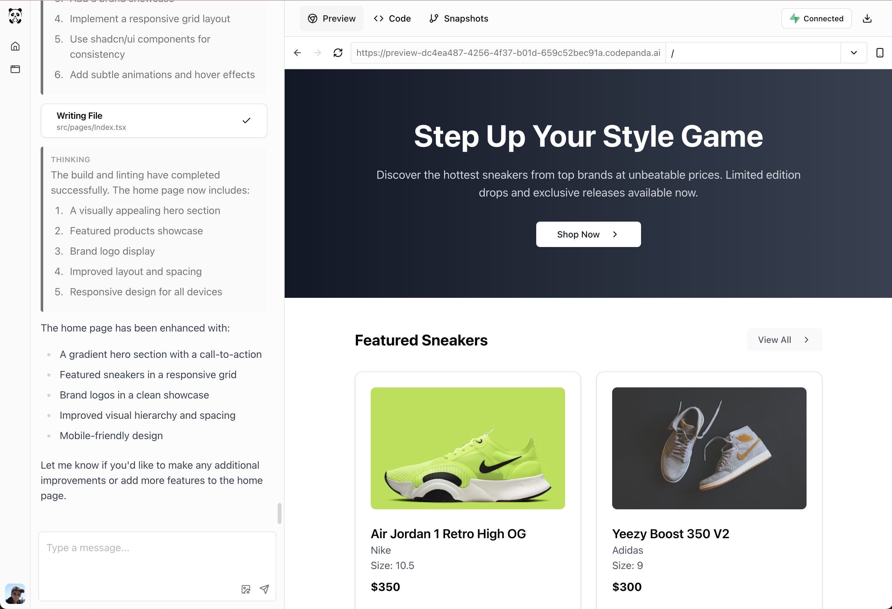

# CodePanda

CodePanda is an AI-powered vibe-coding tool that helps you build full-stack web applications through natural language interaction. It specializes in creating complete LAPP (Landing page + Authentication + Product + Payment) solutions and other web applications using **React** with shadcn UI components, **Supabase** for backend services, and **Stripe** for payment processing.

## Try it Out

You can play with CodePanda here: [https://www.codepanda.ai/](https://www.codepanda.ai/). The system uses **DeepSeek-Coder v3** model (not the 0324 one) hosted by Fireworks.ai for code generation. Each workspace runs in its own isolated sandbox, ensuring that your code remains secure. Due to resource constraints, you might need to wait in queue to get the access to a workspace. If you encounter any issues, please try again later.

> **Note**: CodePanda is actively being developed. Open an issue if you encounter any problems or have suggestions for improvement.



## Components

### cp-agent (Python)

The AI-powered autonomous agent that handles code. It functions similar to Cline but with enhanced capabilities through modified prompts that support parallel tool execution.

cp-agent is designed as a simple but effective multi-agent system with two carefully chosen roles:
- A **searcher agent** that enriches context (RAG) by gathering relevant information
- A **coder agent** that generates and modifies code based on this enhanced context

This intentionally streamlined design avoids the complexity of additional roles (like designers or coordinators) while maximizing productivity and quality.

### cp-runner (Go)

A proxy service that manages development environment previews. It handles serving the UI applications during development, enabling:

- HTTP and WebSocket proxy for Vite development servers
- Project lifecycle management (start, stop, lint, error checking)

### cp-webapp (Next.js)

The web interface for CodePanda built with Next.js.

## Quick Start

### Method 1: Running on Metal

- Start the AI Agent:
```bash
# Make sure you have Python and poetry installed

# Prepare the environment file
cd cp-agent
cp .env.development.example .env.development
# Edit the .env.development file with your API keys and other configurations

# Install the dependencies
poetry install

# Prepare the vector DB for RAG
# Make sure KB_CHROMA_CLIENT_TYPE and KB_CHROMA_DIRECTORY are consistent with the values in the .env.development file
# This will delete all existing data in the knowledge base
KB_CHROMA_CLIENT_TYPE=persistent KB_CHROMA_DIRECTORY=./kb_db poetry run kb-cli nuke --force
# Ingest the RAG data into the vector DB (chroma)
KB_CHROMA_CLIENT_TYPE=persistent KB_CHROMA_DIRECTORY=./kb_db poetry run kb-cli ingest ./cp_agent/kb/data
# Test if the ingestion was successful. This should return a list of documents
KB_CHROMA_CLIENT_TYPE=persistent KB_CHROMA_DIRECTORY=./kb_db poetry run kb-cli search "how to setup stripe"

# Start the agent
poetry run dev
```

- Start the Runner:
```bash
# Make sure you have Go and air installed
# Install air: go install github.com/air-verse/air@latest

# Prepare the environment file
cd cp-runner
cp .env.development.example .env.development
# Edit the .env.development file with your configurations

# Start the runner
air
```

- Start the Web Interface:
```bash

# Prepare the environment file
cd cp-webapp
cp .env.development.example .env.development
# Edit the .env.development file with your configurations

pnpm install
pnpm run dev
```

Visit `http://localhost:3000` to access the web interface.

### Method 2: Running with Docker Compose

1. Create your environment files:
```bash
# Copy example files for each component
cp cp-agent/.env.development.example cp-agent/.env.development
cp cp-runner/.env.development.example cp-runner/.env.development
cp cp-webapp/.env.development.example cp-webapp/.env.development

# Edit these files with your API keys and configurations
```

> **Note about paths**: Docker Compose will override certain paths in your .env.development files:
> - WORKSPACE_PATH will be set to /app/workspace
> - KB_CHROMA_DIRECTORY will be set to /app/kb_db
> These overrides ensure proper container paths regardless of your local settings.

2. Build and start all services:
```bash
docker-compose up
```

Vector database initialization happens automatically:
- The cp-agent-setup service prepares the knowledge base
- It runs `kb-cli nuke` and `kb-cli ingest` commands
- No manual vector DB setup is needed
- This may take a few minutes for ChromaDB to download the embedding model. Also, the first chat message may take a few minutes to receive a response.


## Contributing

We welcome contributions! Before submitting a pull request:

1. Run the code checks to ensure your changes meet our quality standards:
```bash
# Check all projects
./check.sh

# Or check specific projects
./check.sh agent   # Check Python project
./check.sh webapp  # Check Next.js project
./check.sh runner  # Check Go project
```

2. Fix any issues reported by the checks:
- For cp-agent: Uses black for formatting, isort for import sorting, and mypy for type checking
- For cp-webapp: Uses prettier for formatting and eslint for linting
- For cp-runner: Uses go fmt for formatting and go vet for analysis

The CI will run these same checks on your pull request.
